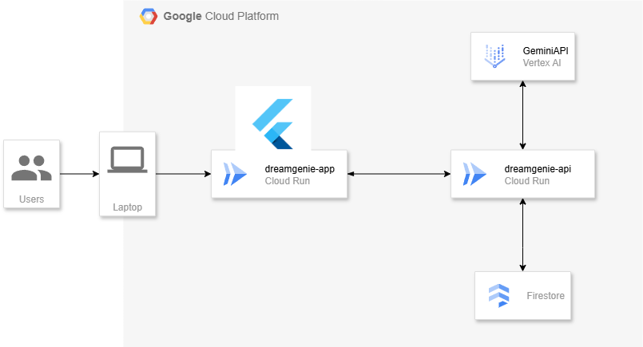

# DreamGenie

## Overview
DreamGenieは、学習や作業計画をAIが自動で補助してくれるアプリです。  
「面倒な計画はAIに任せて、ユーザーは実作業に集中できる」ことをコンセプトにしています。  

ユーザーは学習や作業のゴールを入力するだけで、タスクの細分化から計画の立案、ガントチャートの生成までを自動で行います。  
さらに、予定の変更や追加にも柔軟に対応し、AIが即座にスケジュールを再調整してくれます。  

## Features
- **自動タスク分解 & 計画生成**  
  学習目標やプロジェクトを入力するだけで、AIが最適なステップに分解してスケジュール化。  

- **ガントチャート生成**  
  計画を可視化し、進行状況を直感的に把握可能。  

- **柔軟な予定変更**  
  例:  
  - 「来週に旅行が入っちゃったから一週間遅らせて！」  
  - 「初歩的な文法が分からないから基礎勉強を予定に組み込んで！」  
  こうした変更や追加リクエストにAIが即時対応。  

- **学習に集中できるUX**  
  面倒な計画立案を完全にAIに委任できるため、ユーザーは実際の学習や作業に専念できます。  

## Demo
### Create Page

- タイトル、目標、期間を入力

### Gant Page

- ガントチャートが自動で作成される
- AIとチャット形式でやり取りできる

## Architecture


DreamGenieは**モノリポ構成**で開発されています。  

- `dream_genie`: Flutter製のフロントエンドアプリ  
- `DreamGenie-BE`: Python (FastAPI) 製のバックエンド  
- `schema`: FE-BE間でのHTTP通信に用いるJSONスキーマを定義  

## Sequence diagram


## Deployment
- **インフラ**: GCP CloudRun  
- **Docker**: BE/FEともにDockerイメージを用意し、CloudRunにデプロイ  
- **CI/CD**: フロントエンドはGitHub Actionsで自動デプロイを実現  

## Requirements
- Flutter 3.35.3 
- Python 3.10 + FastAPI
- Docker 27.3.1
- GCP (CloudRun, Artifact Registry など)  

## Installation
```bash
# フロントエンド
cd dream_genie
flutter pub get
flutter run

# バックエンド
cd DreamGenie-BE
pip install -r requirements.txt
uvicorn main:app --reload
```
